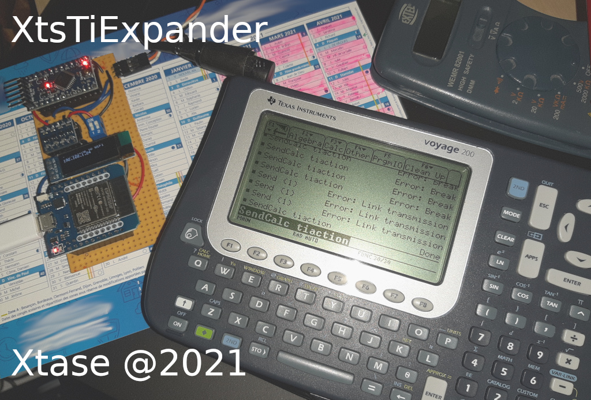

# XtsTiExpander

by Xtase - fgalliat @Jun 2021

- This is an hardware expander for Ti92 / V200 calculator based on XtsTiLink project & an ESP32

- It uses my other project : https://github.com/fgalliat/XtsTiLink_gh.git (for the calc & link part)

  

- The main goal is to provide additional FLASH Storage (that can survive too a Ti-dev-crash), simple Sound & WiFi support to the calculator

- ESP32 has been chosen for it's 2x cores speed, SPIFFS 3MB capacity, RAM amount, cheap & easy to find.

- but for the 1st version of this project, it will be wired as an ESP12 could be, so a WEMOS D1 mini (ESP12F) may could do a part of the job

- In the full project, I plan to have :

  - **as Hardware**

  - ProMini 5v 16MHz - for the TiLink

  - Level converter 5-3.3v 4 lines

  - ESP32 : WiFi - UARTS - STORAGE (builtin) - I2C

  - Buzzer - for simple tones

  - OLED 128x32 I2C mini display (for progress gauges, status display)

  - Push BUTTON

  - battery pack capability

  - **as Software**

  - Ti SendVar -> ESP Storage

  - ESP Storage -> Ti RecvVar (silent mode) (Using : Screen + BTN)

  - Ti SerialTerm

  - Ti telnet client

  - Ti Web REST client

  - ESP telnet / Serial server

    - store/manage VarFiles on SPIFFS -> then prompt to put those on calc

    - control some Ti behaviors (...)

      

